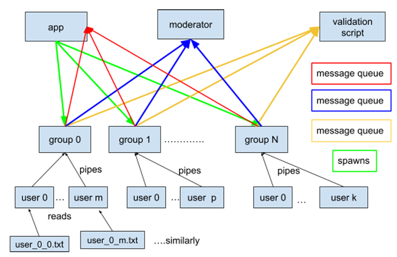

# Chat Management and Moderation System 🛡️📨

## Project Overview
This project is an Operating Systems assignment that simulates a real-time chat management and moderation system for a dystopian regime. The system ensures all user conversations within chat groups are closely monitored, flagged, and moderated according to predefined rules.

The core objective is to build a multi-process, POSIX-compliant system using pipes and System V message queues for communication, demonstrating concepts of IPC, process management, message ordering, and moderation logic.

---

## 📁 Repository Structure
```
├── app.c               # Main control process - spawns and tracks groups
├── groups.c            # Simulates group chat behavior with user processes
├── moderator.c         # Monitors messages for restricted content
├── validation.out      # Intel/AMD/Older Mac (x64) validation binary
├── validation1.out     # Mac M1 (AArch64) validation binary
├── testcases.zip       # Testcase archive
├── image.png           # Block diagram of the system
└── README.md           # Project documentation (you are here!)
```

---

## 🔗 System Overview
The system simulates a chat management and moderation framework where different entities—moderator, groups, and users—are represented as processes. Each group process corresponds to a chat group (like a WhatsApp group) consisting of multiple user processes. Users send messages to their group process via pipes. The group process monitors content for restricted words and interacts with the moderator and validation processes using message queues.

- **Moderator:** Checks messages for violations and bans users exceeding a threshold.
- **Validation:** Ensures message order and correct banning.
- **App:** Spawns group processes and tracks their termination.

**Communication:**
- Three System V message queues (group-app, group-moderator, group-validation)
- Unnamed pipes (user-group)

---

## 🧠 Key Features
- **Real-Time Monitoring:** Tracks messages in real-time from multiple users and flags violations.
- **Inter-Process Communication (IPC):** Uses three System V message queues and unnamed pipes.
- **Moderation Logic:** Violations are detected based on substring matches of banned words.
- **Dynamic User Handling:** Users can be banned or removed based on violations or completion of all messages.
- **Message Ordering:** Ensures strict chronological order of message delivery.
- **Robust Error Handling:** Comprehensive checks for file reads, process creation, and IPC operations.

---

## 🛠️ Compilation Instructions
**Requirements:**
- Ubuntu 22.04 or 24.04 (recommended)
- GCC compiler

**To compile the project:**
```bash
gcc -o app.out app.c
gcc -o groups.out groups.c
gcc -o moderator.out moderator.c
chmod 777 validation.out  # Only needed once
```

---

## ▶️ Execution Workflow
Run the following processes in three separate terminals (replace `<testcase_number>` with your test case):

1. **Validation Process**
   ```bash
   ./validation.out <testcase_number>
   ```
2. **Moderator Process**
   ```bash
   ./moderator.out <testcase_number>
   ```
3. **App Process (Launcher)**
   ```bash
   ./app.out <testcase_number>
   ```
> **Note:** Do NOT run `groups.out` directly — it is automatically invoked by `app.out`.

---

## 📊 Block Diagram



- **Red arrows:** Message queue between group processes and app process
- **Green arrows:** App process spawns group processes
- **Blue arrows:** Message queue between group processes and moderator process
- **Yellow arrows:** Message queue between group processes and validation process
- **Black arrows:** Unnamed pipes between user processes and their group process

---

## 🧩 Module Descriptions

### 1. `app.c` – Main Controller
- Reads configuration from `input.txt`.
- Spawns N group processes.
- Tracks termination of each group.
- Prints termination messages, e.g.:
  > All users terminated. Exiting group process X.

### 2. `groups.c` – Group & User Management
- Each group forks multiple user processes.
- Users read from their files and send messages via pipes.
- Group process:
  - Sorts messages by timestamp.
  - Forwards valid messages to `validation.out`.
  - Sends every message to the moderator.
  - Bans users if notified.
  - Terminates when users < 2.

### 3. `moderator.c` – Filter Enforcer
- Loads restricted words from `filtered_words.txt`.
- Performs case-insensitive substring match.
- Tracks and increments violation counts.
- Bans users if they exceed the violation threshold.
- Logs removal:
  > User X from group Y has been removed due to M violations.

---

## 🧪 Input Files & Structure
```
testcase_<X>/
├── input.txt                 # Main config file
├── filtered_words.txt        # Restricted words (one per line)
├── groups/
│   └── group_<id>.txt        # Lists users in that group
└── users/
    └── user_<group>_<id>.txt # Timestamped messages
```

### Sample `input.txt` Format
```
3                         # number of groups
3430                      # validation queue key
4928                      # app-group queue key
9131                      # moderator queue key
5                         # violation threshold
groups/group_0.txt
groups/group_3.txt
groups/group_7.txt
```

---

## 🧠 Implementation Details
- **Validation Message Types:**
  - `mtype = 1` → New group
  - `mtype = 2` → New user
  - `mtype = 3` → Group termination
  - `mtype = 30+grp_num` → Message from group
- **Moderator Message Queue:**
  - Send from group: `mtype = 100 + grp_num`
  - Receive in group: `mtype = 300 + grp_num`
- **Error Handling:**
  - Comprehensive checks for file reads, `fork()`, `pipe()`, `msgsnd()`, and `msgrcv()`.

---

## ⚠️ Constraints & Guidelines
- No use of threads, mutexes, or shared memory.
- Must use only:
  - **Message Queues:** for validation/app/moderator
  - **Unnamed Pipes:** for user-to-group
- All input files are ASCII text.
- Must ensure correct closure of unused pipe ends.
- No use of `goto` statements.

### Testcase Constraints
- Max. number of groups per test case: **30**
- Max. number of users per group: **50**
- Max. number of filtered words: **50**
- Max. length of a filtered word: **20**
- Max. length of a line in users_X_Y.txt: **256** characters
- Max. message timestamp: **2147000000**

---

## 📝 Output Messages
- **On user removal:**
  > User <X> from group <Y> has been removed due to <M> violations.
- **On group termination:**
  > All users terminated. Exiting group process <X>.
- **On success:**
  > Testcase passed: ...

---

## Implementation Guidelines and Constraints
- **Validation Binary:**
  - Intel/AMD/Older Mac (x64): use `validation.out`
  - Mac M1 (AArch64): use `validation1.out`
- **Error Handling:**
  - Perform proper error handling for all system calls.
- **File Specifications:**
  - All `.txt` files are ASCII (text-only) files.
- **IPC:**
  - Only pipes and message queues are allowed.
- **Input Restrictions:**
  - No additional inputs beyond those specified.
- **Synchronization and Multithreading:**
  - No mutexes, semaphores, or multithreading.
- **Pipe Management:**
  - Close all unused pipe ends to prevent resource leaks.
- **No unstructured programming constructs:**
  - Do not use `goto`.

---

## 📚 References
- [Linux man pages: msgget, msgsnd, msgrcv, fork, pipe, exec](https://man7.org/linux/man-pages/)
- [POSIX IPC documentation](https://pubs.opengroup.org/onlinepubs/9699919799/)

---

## 👨‍💻 Authors
- Arvind

---

**Happy Coding!** 🚀
